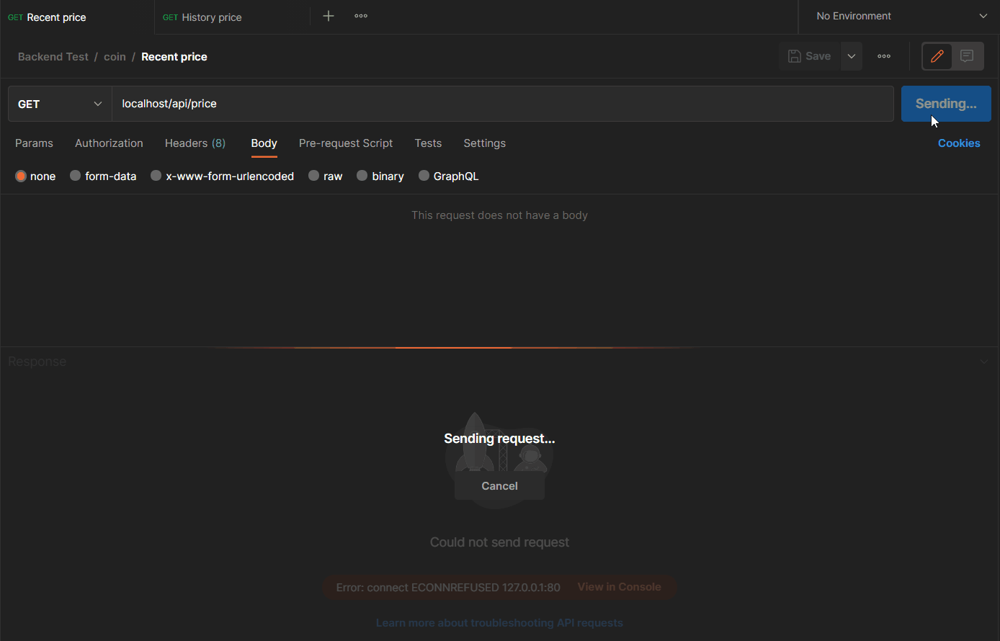

# Crypto Api 🪙



## Sobre o projeto
Esta é uma Api que faz uso de um serviço externo e disponibiliza 2 endpoints principais. Um endpoint para obter o preço mais recente de uma criptomoeda, e outro para retornar o preço de uma criptomoeda baseado em uma data fornecida.

## Configurando o projeto ⚙️

```bash
    # Faça o clone do repositório
    git clone https://github.com/Ronildo-Sousa/crypto_api.git
```
```bash
   # Entre na pasta do projeto e instale as dependências utilizando o Docker
    docker run --rm \
        -u "$(id -u):$(id -g)" \
        -v $(pwd):/var/www/html \
        -w /var/www/html \
        laravelsail/php81-composer:latest \
        composer install --ignore-platform-reqs
```
```bash
    # Crie o arquivo .env
    cp .env.example .env

    # Inicialize o container Sail
    ./vendor/bin/sail up -d

    # Crie a chave da aplicação
    ./vendor/bin/sail artisan key:generate

    # Execute as migrations e seeders
    ./vendor/bin/sail artisan migrate --seed
```

## Endpoints 🔀

### Preço mais recente de uma moeda
```php
    # Este endpoint retorna o preço mais recente do Bitcoin
    GET: localhost/api/price/
```
```php
    # Retorno para este endpoint
    {
        "recent_price": {
            "name": "Bitcoin",
            "symbol": "BTC",
            "date": "03-11-2022 14:06:59",
            "price": 20122
        }
    }
```
```php
    # Este endpoint também aceita outras moedas como parâmetro
    GET: localhost/api/price/dacxi

    GET: localhost/api/price/ethereum

    GET: localhost/api/price/cosmos
```

### Preço de uma moeda em uma determinada data

```php
    # Este endpoint retorna o preço do Bitcoin em uma determinada data
    GET: localhost/api/history/
    
    Body:
    {
        "date": "11-10-2022 23:36:08"
    }
```

```php
    # Retorno para este endpoint
    {
        "history_price": {
            "name": "Bitcoin",
            "symbol": "BTC",
            "date": "11-10-2022 23:36:08",
            "price": 19142.694
        }
    }
```
```php
    # Este endpoint também aceita outras moedas como parâmetro
    GET: localhost/api/history/dacxi

    GET: localhost/api/history/ethereum

    GET: localhost/api/history/cosmos
```
